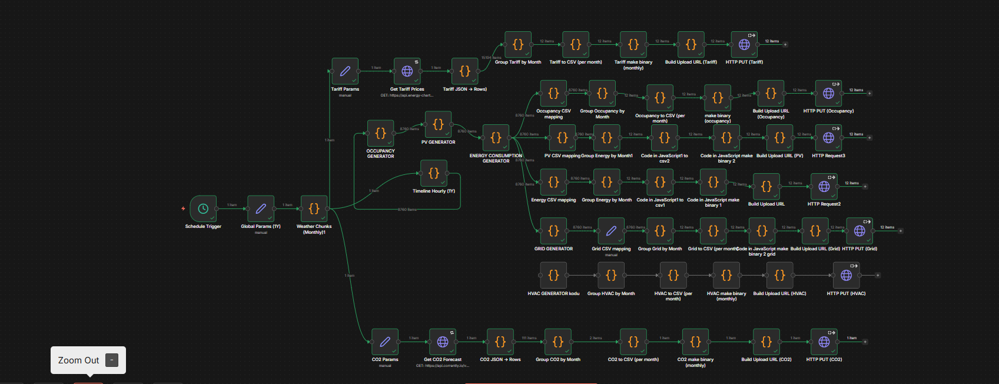
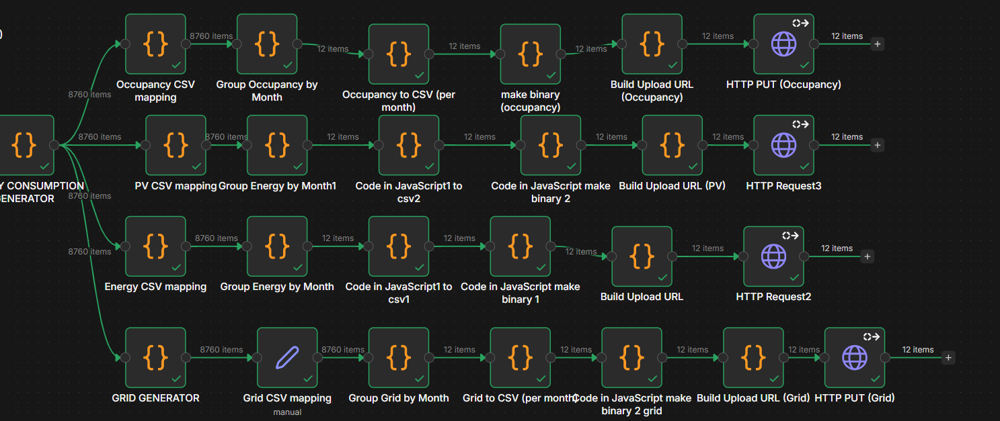
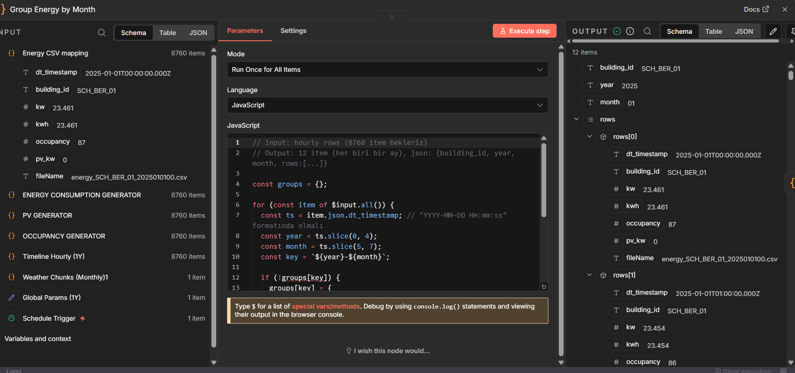

# 02 — Data Ingestion (n8n)

## Goal
Design a production-minded ingestion layer that generates and exports
smart building datasets at scale.

The focus is not realism of individual values,
but **time consistency, partitioning, and analytics readiness**.

---

## What was built
- Hourly datasets (8760 rows / year) for:
  - Energy consumption
  - PV generation
  - Grid import/export
  - Occupancy
  - HVAC
  - Tariff
  - CO₂ intensity
- Standardized hourly timeline (`dt_timestamp`)
- Monthly partitioned CSV exports
- Direct upload to Azure Blob / OneLake via HTTP PUT

---

## Main workflow — overview

The n8n workflow acts as a **data factory**.
Each domain follows the same repeatable pattern.

---

## Reference implementation — Energy branch

The **Energy branch** is the reference pattern.
All other domains (PV, Grid, Occupancy, HVAC, etc.)
reuse the same structure.

---

## Critical logic — Group by Month

Monthly grouping is performed explicitly using `dt_timestamp`
to avoid implicit or broken month inference.

This ensures:
- Exactly 12 outputs per year
- One CSV per month
- Stable downstream partitioning

---

## Why this matters
- Enables incremental processing in Microsoft Fabric
- Aligns with lakehouse partitioning best practices
- Scales naturally to multi-building scenarios
- Separates ingestion logic from analytics logic
